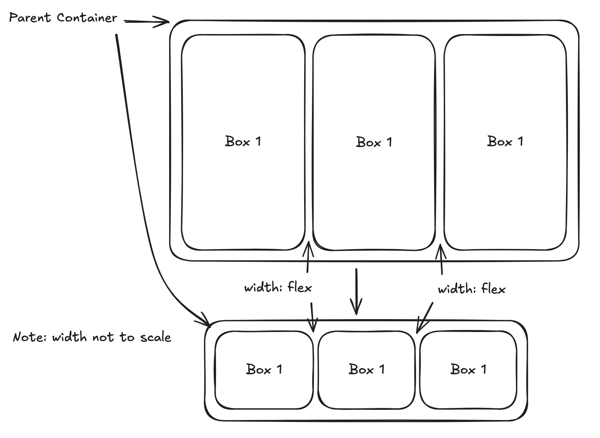

1. **Discuss the role of HTML, CSS, and JavaScript in creating responsive web pages. Explain the significance of asynchronous programming in improving web page load times and user experience. (4 marks)**  
   HTML, short for Hypertext Markup Language, creates the base layout of a webpage.  
   CSS, short for Cascading Style Sheets, adds aesthetics to the layout, as well as controlling the scaling of the webpage.  
   JavaScript adds functionality to the HTML base file, improving the responsiveness by enabling the webpage to handle other tasks.  
   Together, they enable a functional and responsive webpages to be created if implemented in the code.  
   Asynchronous programming is when other tasks are performed while one is awaiting a response.  
   Asynchronous programming improves web user experience by enabling slower tasks to be handled in the background, thus keeping other elements such as the user interface responsive.  
   For example, asynchronous programming would allow a website to fetch a user’s total number of points while displaying potential methods to earn more points.  
   This creates responsive web pages as the user is able to perform other actions on the same website.  
     
2. **Explain how slow page loading can impact user engagement and suggest web programming techniques to improve it. (2 marks)**  
   Slow page loading can negatively impact user engagement due to the inability to instantaneously access the information that they need.  
   For example, if an online learning platform loads slowly, the student will lose interest in learning from that source as they have to wait to access information.  
   Some web programming techniques to mitigate this include minifying images, optimising code and investing in more powerful server hardware.  
     
3. **Explain two benefits of HTML and CSS in web development. Provide an example of how they work together to structure and style a webpage. (4 marks)**  
   HTML and CSS are extremely important as sophisticated webpage layouts simply could not exist without them.  
   The HTML provides the outline for the layout of the website, for example, where headers are and where images go.  
   The CSS expands on the layout by adding the options for how each element of the HTML should be layout, for instance, detailing the colour and font of a heading.  
   Together, HTML and CSS help to create aesthetic webpages with solid structures.  
   For example, an online business website requires a structured layout as well as an easy to navigate interface that is pleasant to the eye.  
   HTML provides the structure while CSS builds on the elements of the HTML structure, creating an engaging and aesthetic website.  
     
4. **Outline what JavaScript is and how it enhances the functionality of a webpage. Provide an example where JavaScript is used to validate user input on a web form. (2 marks)**  
   JavaScript is a programming language that can perform actions based on input.   
   It can enhance functionality of webpages by validating user input or adding responses to user actions.   
   For example in a web form, the user input can be validated using JavaScript to check for certain conditions such as whether a password is longer than 8 characters.  
   This forces users to enter passwords that are more difficult to crack, thus enhancing the overall legitimacy, ensuring the form functions properly.  
     
5. **Discuss the importance of optimising webpage load time for user experience. Provide three techniques to improve the loading speed of a website. (2 marks)**  
   Optimising webpage load times enhances user experience.  
   It enables the user to access the information that they need almost immediately. This ensures user satisfaction as the page loads and responds quickly.  
   Three techniques to improve the loading speed of a website are:   
   1. Minifying images (optimising resolution and choosing the best image format).  
   2. Optimising code. Writing the same functionality in fewer lines enables the computer to execute the script faster.  
   3. Investing in more powerful server hardware to enable more responsive webpages, thus improving user experience.

6. **Explain how the CSS Flexbox layout works. Provide a simple example of how you would use Flexbox to create a row of three equal-width boxes that adapt to the screen size. You may include a diagram and annotation. (4 marks)**  
   The CSS Flexbox layout is a layout that adjusts the display of each element to the developer’s requirements.   
   This is based on screen resolution window size.  
   A webpage uses CSS Flexbox if the program contains display: flex or display: inline-flex.  
   In CSS Flexbox, there is a parent container called the ‘flex container’. The children that are within the container are known as the ‘flex items’.  
   Here is an example of the CSS Flexbox layout, used to create a row of three equal width boxes that adapt to the screen size.   
   The parent container defines the screen size in this example.

   ****
   The width of both the boxes and the space in between dynamically adjusts to suit the width of the container.  
   This is because the width of the gap and boxes are variable.

7. **Why is web accessibility important, and what are the two best practices developers should follow to ensure their websites are accessible to all users? Provide examples for each best practice. (2 marks)**  
   Web accessibility is important because it encourages the development of higher-quality webpages, driven by the need to make them accessible to everyone.  
   Two best practices developers should follow are adhering to the W3C and I18N standards.  
   For example, including an accessible layout as per the guidelines of the I18N ensures the quality of a website as they enable more people to access the same content.  
     
8. **Discuss the importance of cross-browser compatibility. (3 marks)**  
   Cross-browser compatibility is extremely important as it enables everyone to access the same content in their own way.   
   This is because different browsers use different rendering engines, so ensuring that web applications function the same across all browsers enables everyone to view the same content.  
   For example, if a webpage only functioned as intended on Google Chrome, then those who choose to use other browsers would not be able to access the website in the same way.  
   This is unfair to those who cannot use Google Chrome because they are simply not able to access the content in full.  
     
9. **Explain the use of the \<canvas\> tag in HTML design? Give an example. (2 marks)**  
   The \<canvas\> tag creates a canvas within the HTML file that allows graphics to be drawn over it.  
   These graphics are drawn using javascript code.
   For example, in a web simulation program, the canvas element because the values are not predetermined.   
   This enables the user to enter values, without the \<canvas\> tag, there would be no simulators. 
   In summary, the canvas tag acts like a physical canvas, enabling the site to ‘paint’ graphics on the blank template. 
     
10. **Justify why the World Wide Web wasn’t ‘designed’ to be ‘secure’ when it first emerged in the 1980s. (5 marks)**  
    There are some reasons why the World Wide Web (WWW) wasn’t designed to be secure when it first emerged. These are:  
      1. The WWW first appeared in 1984, created by Tim Berners Lee. At this time electronic secure transactions such as banking did not exist.  
      2. The Internet is a network used to connect two or more machines. The WWW is a large network of computers that share data between each other over the Internet.  
      3. Back in the day, the web was designed for a small and trusted community of users. This meant that security was not a major concern. The initial structure of the web was based on the assumption of trust.  
      4. The creators of the web did not think that activities like shopping, banking or sensitive communications would be done on their platform so there were no initial security measures for such actions.  
      5. Originally, the web was designed for quick and efficient data sharing, leading to development of protocols without security features e.g. HTTP. Security features were added later as vulnerabilities emerged.  
      6. The web’s architecture was originally designed to be open, decentralised and flexible. Security mechanisms were complex, and potentially slowed down adoption while the internet was still growing, had they been implemented.

      Due to these reasons, the WWW was not designed to be secure, rather, it evolved into a platform which needed security to survive.